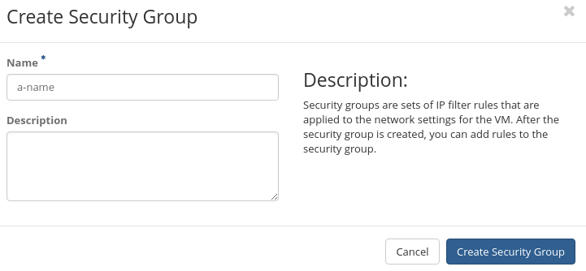

# Openstack

## Cloud

Openstack is a cloud system. The term *Cloud* is used for systems which try to extract computers or servers
into abtract objects. In the old world we used to talk about servers or virtual machines. With virtual machines
we try to mimic a server or a computer. In a Cloud we talk about *instances* which is a combination of
* virtual cpu's
* network interfaces
* memory
* root storage
* (disk) volumes
* security templates (firewall)
Scripting is imported in cloud systems. In general instances are fully configured by script. If a instance has a problem,
normally a new instance is created and the defect is deleted since creating a new one is fast.

## Openstack Web interface (Horizon)

The webaddress is https://stack.naturalis.nl. You can log in with your provided credentails for openstack. On the left are the elements
of openstack. You have the global groups: 
* Project 
* Admin 
* Identity 
* Applications

For most users only the group **Project** is used.
The Project group has: 
* Compute
* Network
* Orchestration
* Data Processing 
* Object store. 

Here only **Compute** is really important.

### Compute

* Overview: You can find a global overview of your resources
* Instances: A list of all your running instances
* Volumes: A list of all your volumes
* Images: A list of all your images of instances
* Access & Security: Here you can configure firewall and access keys

  
  

## Create access credentials with Putty

Access of to a linux server is done by a *ssh keypair*. In on mac and linux systems this is native. For windows
you have to install Putty. You also need puttygen.

Putty: https://the.earth.li/~sgtatham/putty/latest/w64/putty.exe

Puttygen: https://the.earth.li/~sgtatham/putty/latest/w64/puttygen.exe

### Generate ssh keypair in puttygen

Now we are going to import the public key to your openstack environment. Go to **Access & Security** and then to 
**Key Pairs** and then go for **Import Keypair** and copy your public key in the box. Give it a name (something with
our name in it is handy).

We are going to use this later

## Setup firewall (security groups)

Openstack comes with its own firewall. Each firewall rule is called a **security rule** and they are grouped
together in a **security group**. A security group is then applied to an instance.

We are going to create a firewall rule which allows access to the instance via SSH.
Go to **Access & Security** and click on **Create Security Group**

Give it a name (for example, access for `<your name>` development-server)

Now go for **Add Rule**

At **Rule** go for **SSH**. And at **CIDR** go for `0.0.0.0/0`

### CIDR
You can also write a custom rule. You can then define a port (or port-range) which is allowed and also specifiy the CIDR. 
CDIR defines a set of ip addresses which the rule applies to. Above we used `0.0.0.0/0` which means *the whole world*. If you
only want to allow 1 ipaddress (for example, your home computer) you can set `83.37.128.94/32` where `/32` relates to 1 ip address.
If you want to give access to the whole silvius building, you can set a bigger range: `192.168.201.0/24`.
More info can be found here: https://en.wikipedia.org/wiki/Classless_Inter-Domain_Routing

## Create Instance
Now we have all requirements set to create a instance.

Go to **Instances** and click (right side) on **Launch Instance**

At sources with find images of operating systems or snapshots of instances. For now
select `Ubuntu 16.04 LTS`

Flavor relates to the size of the instance. There are predefined sets of flavors. The flavor
names are in the following format: `hpc.<number of cpu>c.<gb of ram>c.<gb of localdisk>h`. For
this workshop only `hpc.2c.2r.20h` is used. 

At networks select the network with name `network`

At security groups, select the security group you created.

At keypair select your keypair.

At configuration you can add a script which will launch first time the server boots. For now
leave empty

click on **Launch Instance**

## Add floating IP address

By default the ip address of an instance is unreachable. It is only reachable from inside it's
own network. A floating IP address is an ip address which connects to the ip address of the instance 
making it reachable from the outside. Naturalis has a set of public ip addresses. Each project in openstack is allowed a set ip addresses.

Click on **Associate Floating IP**

Now it shows *No floating ip addresses allocated*. This means that there are no ip addresses reserved 
for your project. Click on the **+** sign to allocate a floating ip address to your project. Select 
at pool **external** and click on **Allocate IP**. Now you see an ip address which start 
with `145.136.24(0/1/2/3)`. Click on **Associate**. 

The result will be:

## Connecting via SSH to the instance

Start up putty and enter at `Host Name` ubuntu@your-floating-ip-address. Also give your `session` a name 
at `Saved Sessions`.

Now go to `Connection->SSH->Auth` and at `Private key file for authentication` click on `browse` and select your **private key**

Go back to `Session` and click on `Save` and then on `Open`. You are now connected to your instance.

**end of part 1**

