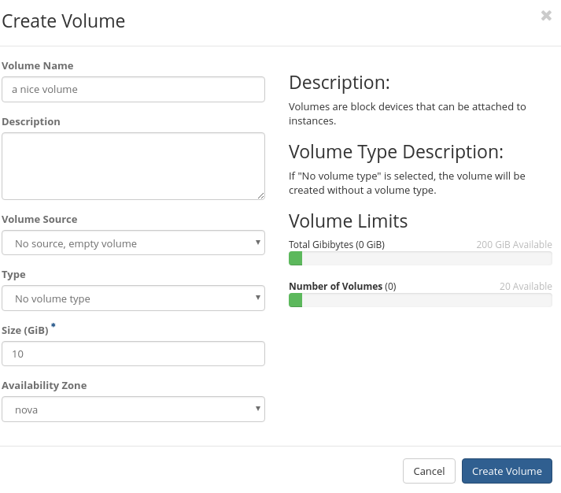

# Storage in openstack

So we now have an instance running. Let start of with adding some extra storage to the instance.
The default storage allocated to the instance is very fast, but not very safe. It is only on one
hypervisor, so if the hypervisor crashes (small chance) you can loose your data.

## Volumes

You can create volumes in openstack. This is external storage added to you instance. This storage is fast and very safe. It is backed by **Ceph**. There are always 3 copies of your data.

First let's check how much space is avaialable. 
```SHELL
df -h
```
Will return
```SHELL
Filesystem      Size  Used Avail Use% Mounted on
udev            994M     0  994M   0% /dev
tmpfs           201M  3.2M  197M   2% /run
/dev/sda1        20G  939M   19G   5% /
tmpfs          1001M     0 1001M   0% /dev/shm
tmpfs           5.0M     0  5.0M   0% /run/lock
tmpfs          1001M     0 1001M   0% /sys/fs/cgroup
tmpfs           201M     0  201M   0% /run/user/1000
```
The default drive is `Mounted on` `/`. We see it has `20G` of storage and `19G` available. In linux a
disk is called a **block device**. To show all block devices available run:
```
lsblk
```
this will return
```
NAME   MAJ:MIN RM SIZE RO TYPE MOUNTPOINT
sda      8:0    0  20G  0 disk 
└─sda1   8:1    0  20G  0 part /
sdb      8:16   0  64M  0 disk 
```
We see 2 block devices of type disk. We now can go to the openstack interface and create a new 
block device. Go to `Project -> Volumes` and click on **Create Volume**. Give the volume 
a name and set the **Size** to 10 (which is 10 GB)



Then click on the downarrow and select **Manage Attachments**


and select your instance and click **Attach Volume**


Now go to your SSH session and run `lsblk` again.
```
NAME   MAJ:MIN RM SIZE RO TYPE MOUNTPOINT
sda      8:0    0  20G  0 disk
└─sda1   8:1    0  20G  0 part /
sdb      8:16   0  64M  0 disk
sdc      8:32   0  10G  0 disk
```
As you can see `sdc` has been added. The disk is empty, so we first have to add a filesystem to it (
don't to this if you alrealy have used the volume). The filesystem `ext4` is the most used
in the linux world. We have to do this as an elivated user (root) so we add `sudo` before 
the commands.
```
sudo mkfs.ext4 -L atzes-volume /dev/sdc
```
Now the filesystem has been created. Let's mount it. First we have to create a directory to mount it.
```
sudo mkdir /data
```
We now can mount it with `mount -L atzes-volume /data` but if we reboot, we have to mount it 
again, let's configure it to mount at boot time.

```
sudo nano /etc/fstab
```
And add a new line
```
LABEL=atzes-volume	/data	ext4	defaults	0 0
```
and hit `ctrl + o` and then `ctrl + x`.

now run `sudo mount /data`
and check `lsblk` and `df -h`. 
To make it writable to the default user, we have to give it our ownership. Let's run
```
sudo chown -R ubuntu:ubuntu /data
```
Now let's to the new volume
```
cd /data
nano nice.txt
```
Write some text save it and exit and then run 
```
cat /data/nice.txt
```
to check if it worked. Now reboot the instance, login again check if you data is still available. To
reboot run `sudo reboot`

## SCP (file copy)

Scp is a protocol used to copy data (files) over SSH. For windows we can use `WinSCP`. The download of WinSCP can be found here: https://winscp.net/download/WinSCP-5.13.3-Portable.zip .
For mac you can use Cyberduck.

So startup WinSCP. It will by default come with a screen to connect to a server
Fill in your ip address and username and set protocol to **SCP**


Click on **Advanced...** and go to `SSH -> Authentication` and add your private key and hit ok.


Click on **Save** to save the session for later use. 


Hit Login. You now should be able to send files to your linux instance.

## Google Drive

We can connect to google drive through **rclone**.
* Go to https://drive.google.com
* Wait for 'Team Drive' or 'Drives van mijn team' to arive
* Click on it and hit **+**
* Give it a name


To install rclone run:
```
sudo apt update
sudo apt install unzip
curl https://rclone.org/install.sh | sudo bash
```

Then run
```
rclone config
*-> new remote
*-> set name 'drive' (or something else)
*-> select 11 (google drive)
*-> leave clientid and secret id empty
*-> select 1 or 2 (full access or read only)
*-> at root folder leave blank
*-> service account, leave blank
*-> at autoconfig select N
*-> open the link and continue
*-> copy the code and past in your SSH session
*-> configure as teamdrive (y)
*-> select created team drive
*-> select y at confermation
*-> hit q to quit
```

Then we can copy files to our drive
```
rclone copy /data/nice.txt drive:
```
To copy it in a folder run
```
rclone copy /data/nice.txt drive:test
```
Or in a subfolder
```
rclone copy /data/nice.txt drive:test/nicer
```

to list files in your team drive
```
rclone ls drive:
```
or in a folde
```
rclone ls drive:test
```

To copy a file from drive

```
rclone copy drive:test/nice.txt ./
```

## Minio (S3 compatable)

First install the `go` language
```
sudo apt update
sudo apt install golang-go
curl https://golang.org/src/crypto/tls/generate_cert.go?m=text > generate_cert.go
```
create a minio config directory for cerficicates
```SHELL
mkdir -p .minio/certs
go run generate_cert.go -ca --host "your-floating-ip-address"
mv cert.pem .minio/certs/public.crt
mv key.pem .minio/certs/private.key
```
Download minio and run
```
wget https://dl.minio.io/server/minio/release/linux-amd64/minio
chmod +x minio
./minio server /mnt/data
```

With your webbrowser go to https://your-floatig-ip:9000 shown and login the *accesskey* and *secretkey*

Whats happening??

> **Assignment**:
>
> Update your Security Group to allow port 9000

You can create a bucket, which is a directory. You can use **+** to add an file.

Now you can check if the file is somewhere in `/data`

You can share a file here with other people. Click on the **...** behand a file and
select the copy sign. Here a shareable link (with an max age) will appear.


**end of part 2**


