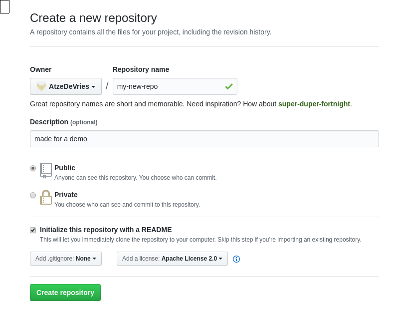
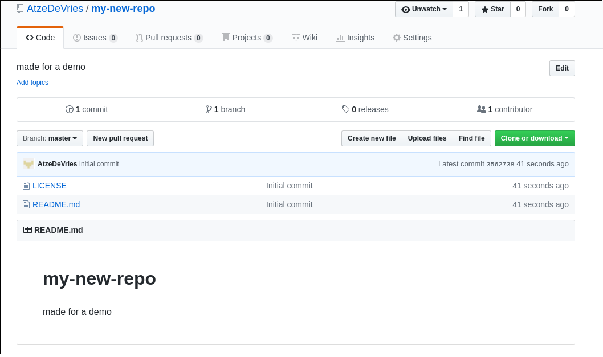

# Git

Git is a version control system (VCS). This means that if you write code you can easly manage multiple
versions of you code. It also allows you to work together on code. 

## Some examples

First make a directory 
```
mkdir git-test
cd git-test
```
Then initialize git and add some content
```
git init
echo 'hello' >> 1.txt
echo 'world' >> 2.txt
git status
```
Then we add and commit.
```
git add *
git commit -a -m 'a message for this commit'
```
Create a new branch from your current branch (master)
```
git checkout -b code-test
echo 'mars' > 2.txt
git commit -a -m 'updated planet'
git checkout master
cat 2.txt
git checkout code-test
cat 2.txt
```
Get new code into master (merge)
```
git checkout master
git merge code-test
cat 2.txt
```

## Storing code on github.com

For this section you need a github.com account. If you don't have it, go to https://github.com and create one.

If you have a account create a new repository at the **+** sign on the right


Give it a name, a descripion an a licence (Apache 2.0 is good)



here is a overview of your respository



now to to your instance and run in a new directory

```
git clone https://github.com/<your-username>/<your reponame>
```

Now like in the previous git example create some data and commit. When you are done commiting
run

```
git push
```
and then check the status on github.com

On github.com you can also change code. Try to change code and then on the instance run

```
git pull
```


